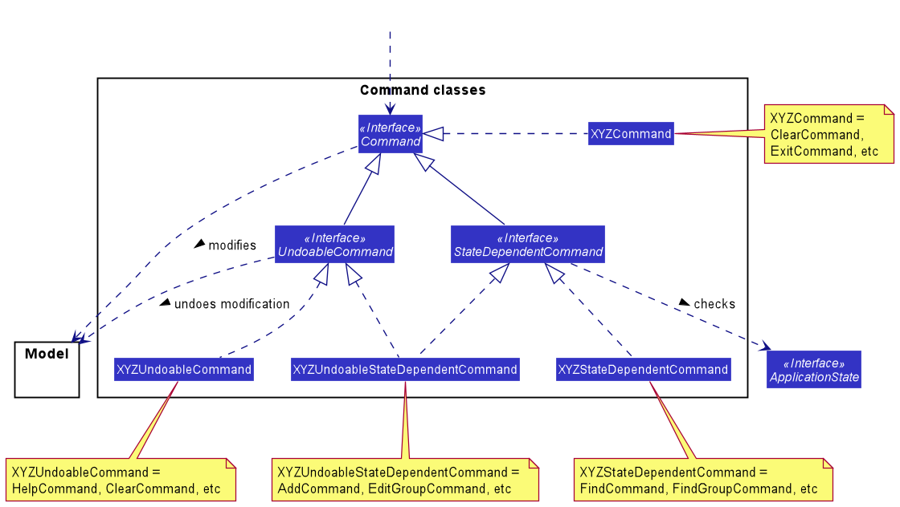
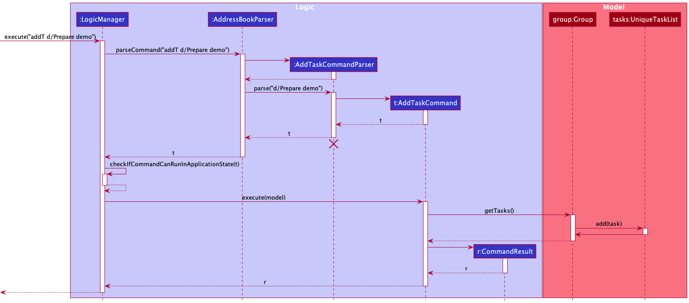
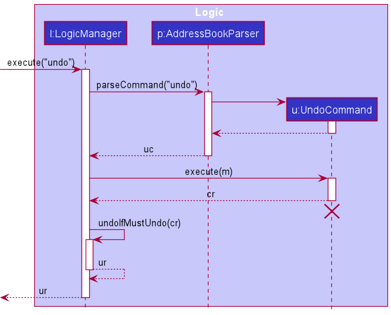
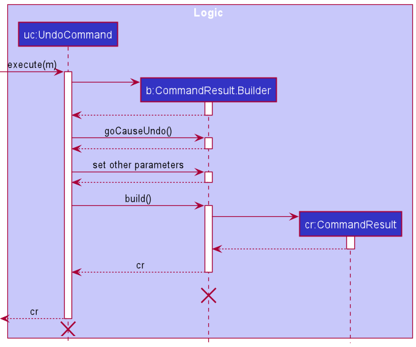
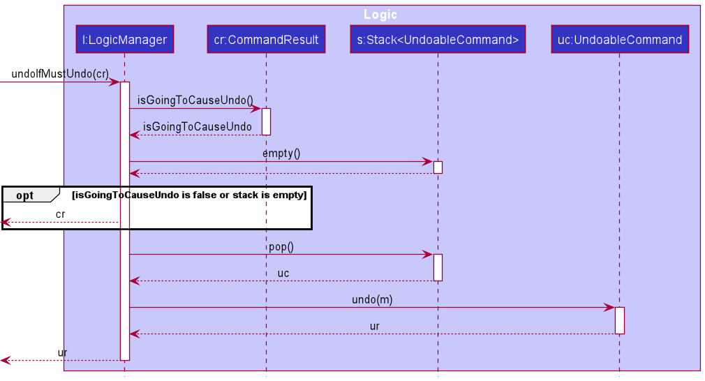
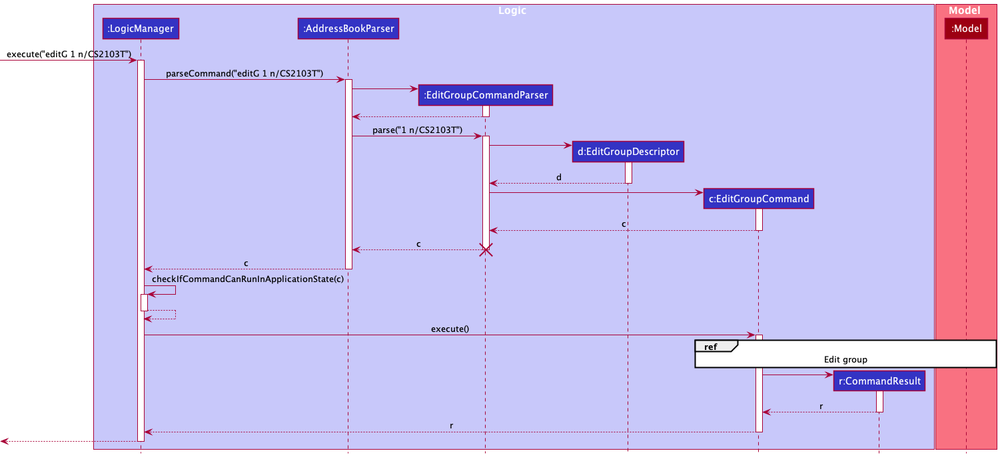
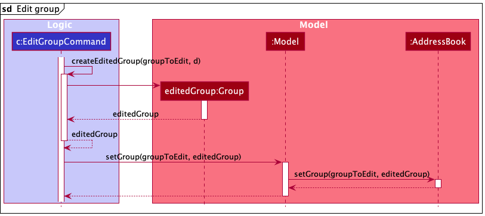
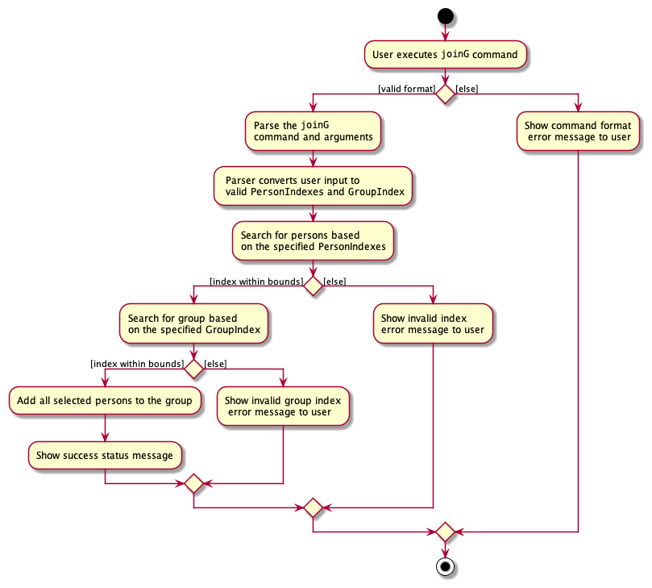

Welcome to the **ThunderCat Developer Guide**.

**ThunderCat** is a desktop app designed for Year 2 Computing Students and 
acts as an address book for contacts with added support for group projects. 
Users can manage contacts, organise them into project groups and manage their tasks according to those groups. 

This guide contains detailed information on the architecture, implementation and design decisions for ThunderCat. This guide has been designed 
for our intended audience of software testers and developers who are interested in the inner workings of ThunderCat, or those who seek alter and extend the app for their own use.

--------------------------------------------------------------------------------------------------------------------

* Table of Contents
{:toc}

--------------------------------------------------------------------------------------------------------------------

## **Acknowledgements**

This project is based on the [AddressBook Level-3 project](https://se-education.org/addressbook-level3/) created by the [SE-EDU initiative](https://se-education.org).

* Libraries used: [JavaFX](https://openjfx.io/), [Jackson](https://github.com/FasterXML/jackson), [JUnit5](https://github.com/junit-team/junit5)

--------------------------------------------------------------------------------------------------------------------

## **Setting up, getting started**

Refer to the guide [_Setting up and getting started_](SettingUp.md).

--------------------------------------------------------------------------------------------------------------------

## **Design**

:bulb: **Tip:** The `.puml` files used to create diagrams in this document can be found in the [diagrams](https://github.com/se-edu/addressbook-level3/tree/master/docs/diagrams/) folder. Refer to the [_PlantUML Tutorial_ at se-edu/guides](https://se-education.org/guides/tutorials/plantUml.html) to learn how to create and edit diagrams.

### Architecture

The ***Architecture Diagram*** given above explains the high-level design of the App.

Given below is a quick overview of main components and how they interact with each other.

**Main components of the architecture**

**`Main`** has two classes called [`Main`](https://github.com/se-edu/addressbook-level3/tree/master/src/main/java/seedu/address/Main.java) and [`MainApp`](https://github.com/se-edu/addressbook-level3/tree/master/src/main/java/seedu/address/MainApp.java). It is responsible for,
* At app launch: Initializes the components in the correct sequence, and connects them up with each other.
* At shut down: Shuts down the components and invokes cleanup methods where necessary.

[**`Commons`**](#common-classes) represents a collection of classes used by multiple other components.

The rest of the App consists of four components.

* [**`UI`**](#ui-component): The UI of the App.
* [**`Logic`**](#logic-component): The command executor.
* [**`Model`**](#model-component): Holds the data of the App in memory.
* [**`Storage`**](#storage-component): Reads data from, and writes data to, the hard disk.

**How the architecture components interact with each other**

The *Sequence Diagram* below shows how the components interact with each other for the scenario where the user issues the command `delete 1`.

Each of the four main components (also shown in the diagram above),

* defines its *API* in an `interface` with the same name as the Component.
* implements its functionality using a concrete `{Component Name}Manager` class (which follows the corresponding API `interface` mentioned in the previous point.

For example, the `Logic` component defines its API in the `Logic.java` interface and implements its functionality using the `LogicManager.java` class which follows the `Logic` interface. Other components interact with a given component through its interface rather than the concrete class (reason: to prevent outside component's being coupled to the implementation of a component), as illustrated in the (partial) class diagram below.

The sections below give more details of each component.

### UI component

The **API** of this component is specified in [`Ui.java`](https://github.com/se-edu/addressbook-level3/tree/master/src/main/java/seedu/address/ui/Ui.java)

The UI consists of a `MainWindow` that is made up of parts e.g.`CommandBox`, `ResultDisplay`, `ListPanel`, `StatusBarFooter` etc. All these, including the `MainWindow`, inherit from the abstract `UiPart` class which captures the commonalities between classes that represent parts of the visible GUI.

The `UI` component uses the JavaFx UI framework. The layout of these UI parts are defined in matching `.fxml` files that are in the `src/main/resources/view` folder. For example, the layout of the [`MainWindow`](https://github.com/se-edu/addressbook-level3/tree/master/src/main/java/seedu/address/ui/MainWindow.java) is specified in [`MainWindow.fxml`](https://github.com/se-edu/addressbook-level3/tree/master/src/main/resources/view/MainWindow.fxml)

The `UI` component,

* executes user commands using the `Logic` component.
* listens for changes to `Model` data so that the UI can be updated with the modified data.
* keeps a reference to the `Logic` component, because the `UI` relies on the `Logic` to execute commands.
* depends on some classes in the `Model` component, as it displays `Person`, `Group`, `Task` objects residing in the `Model`.

### Logic component

**API** : [`Logic.java`](https://github.com/se-edu/addressbook-level3/tree/master/src/main/java/seedu/address/logic/Logic.java)

Here's a (partial) class diagram of the `Logic` component:

How the `Logic` component works when executing a command:
1. When `Logic` is called upon to execute a command, it uses the `AddressBookParser` class to parse the user command.
2. The `AddressBookParser` class may then call other `Parser` classes to parse specific commands.
3. This results in a `Command` object (more precisely, an object of one of the classes that implement it e.g., `AddCommand`).
4. The `Command` object is checked if it can be executed in the current `ApplicationState`.
5. If it cannot be executed, then a `CommandException` is thrown and the `Command` object is not executed. Otherwise, if it can run in the current `ApplicationState`, then the `Command` object is executed by the `LogicManager`.
6. The command can communicate with the `Model` when it is executed (e.g. to add a person).
7. The result of the command execution is encapsulated as a `CommandResult` object which is returned from `Logic`.
8. The current `ApplicationState` is updated using the details from the `CommandResult`.

The Sequence Diagram below illustrates the interactions within the `Logic` component for the `execute("delete 1")` API call, assuming the application is in a state where it can execute the `delete` command.

:information_source: **Note:** The lifeline for `DeleteCommandParser` should end at the destroy marker (X) but due to a limitation of PlantUML, the lifeline reaches the end of diagram.

#### Parser classes

Here are the other classes in `Logic` (omitted from the class diagram above) that are used for parsing a user command:

How the parsing works:
* When called upon to parse a user command, the `AddressBookParser` class creates an `XYZCommandParser` (`XYZ` is a placeholder for the specific command name e.g., `AddCommandParser`) which uses the other classes shown above to parse the user command and create a `XYZCommand` object (e.g., `AddCommand`) which the `AddressBookParser` returns back as a `Command` object.
* While parsing, the `AddressBookParser` may use information from the `ApplicationState` such as what type of state it is or what data it is storing. Stored data can include things like [`Group` objects](#model-component).
* All `XYZCommandParser` classes (e.g., `AddCommandParser`, `DeleteCommandParser`, ...) inherit from the `Parser` interface so that they can be treated similarly where possible e.g, during testing.

#### Command classes

There are different `Command` sub-types:
* Any implementation of `UndoableCommand` can be undone. After they execute and modify the contents of `Model`, they can undo these modifications.
* Any implementation of `StateDependentCommand` can check what `ApplicationState` the application is currently in and allow itself to be executed if the command can run in that `ApplicationState`, or instead block execution.

#### Application state classes

In order to keep track of when the application is on the Home Page or the Group Information Page, the application keeps track of what state it is currently in or what state it will be in after a `Command` is executed. The `ApplicationState` interface is used for this purpose. There are different `ApplicationState` sub-types:
* The `HomeState` refers to the state the application is in when it is showing the Home Page.
* The `StoredDataApplicationState` is an `ApplicationState` sub-type that can store data to be used by the components of the application.
* The `GroupInformationState` refers to the state the application is in when it is showing the Group Information Page. It stores the `Group` object representing the group that is being displayed in the Group Information Page. This `Group` object can be used by `Command` implementations to perform operations on the object or by the `Ui` component for displaying the group's details.

### Model component
**API** : [`Model.java`](https://github.com/se-edu/addressbook-level3/tree/master/src/main/java/seedu/address/model/Model.java)

The `Model` component,

* stores the ThunderCat data i.e.
  * all `Person` objects (which are contained in a `UniquePersonList` object).
  * all `Group` objects (which are contained in a `UniqueGroupList` object). 
  * all `Task` objects (which are contained in a `UniqueTaskList` object).
* stores the currently 'selected' `Person` objects (e.g., results of a search query) as a separate _filtered_ list which is exposed to outsiders as an unmodifiable `ObservableList<Person>` that can be 'observed' e.g. the UI can be bound to this list so that the UI automatically updates when the data in the list change.
* works similarly for the `Group` objects.
* stores a `UserPref` object that represents the user’s preferences. This is exposed to the outside as a `ReadOnlyUserPref` objects.
* does not depend on any of the other three components (as the `Model` represents data entities of the domain, they should make sense on their own without depending on other components)
* UniqueTaskList is stored inside every group

:information_source: **Note:** An alternative (arguably, a more OOP) model is given below. It has a `Tag` list in the `AddressBook`, which `Person` references. This allows `AddressBook` to only require one `Tag` object per unique tag, instead of each `Person` needing their own `Tag` objects. 

### Storage component

**API** : [`Storage.java`](https://github.com/se-edu/addressbook-level3/tree/master/src/main/java/seedu/address/storage/Storage.java)

The `Storage` component,
* can save both address book data and user preference data in json format, and read them back into corresponding objects.
* inherits from both `AddressBookStorage` and `UserPrefStorage`, which means it can be treated as either one (if only the functionality of only one is needed).
* depends on some classes in the `Model` component (because the `Storage` component's job is to save/retrieve objects that belong to the `Model`)

### Common classes

Classes used by multiple components are in the `seedu.addressbook.commons` package.

--------------------------------------------------------------------------------------------------------------------

## **Implementation**

This section describes some noteworthy details on how certain features are implemented.

### Mark As Done Command (Task) 

The mark-as-done mechanism is facilitated by `MarkAsDoneCommand` and `MarkAsDoneCommandParser`. This command allows users to mark a task in a group as `done`.

#### Implementation

Given below is an example usage scenario and how the `done` mechanism behaves at each step.

1. User enters the `done INDEX` command, and the user input is taken into `LogicManager#execute(String commandText)`.
2. `LogicManager` calls `AddressBookParser#parseCommand(String userInput, ApplicationState currentApplicationState)` which parses the user input along with the current application state.
3. `MarkAsDoneCommandParser#parse(String args)` retrieves the task index from the arguments parsed, as well as the group specified by the current application state.
4. A new `MarkAsDoneCommand` object will be created with the task index and the group.
5. `LogicManager#execute(String commandText)` checks if this command object is able to run in the current application state. This operation is exposed in the `LogicManager` class as `LogicManager#checkIfCommandCanRunInApplicationState(Command command)`.
6. If the command is able to run, `MarkAsDoneCommand#execute(Model model)` will check if the task index  is a valid index (Ie if the task index is within the bounds of the indices of the task list). If it is not valid, an error message will be displayed.
7. If the task index is valid, the task's done status is retrieved and marked as done. This operation is exposed in the Task class as `Task#setDoneTask()`. 

    * **Note**: If the task has already been marked as done, an error message will be displayed.
8. The `CommandResult` of the execution will then be retrieved, and the display will change to show the result of the execution.

The following activity diagram shows the workflow of a typical MarkAsDoneCommand:

#### Design Considerations
Aspect: How `done` executes:

* Alternative 1: If the task is already marked as done, `done` command simply toggles the `done` status to `not done`.
    * Cons: May mark a done task as `not done` if User accidentally calls the command twice.
    * Pros: Allows User to toggle between `done` and `not done` if they realise that a task was previously accidentally marked as done.
    

* Alternative 2 (current implementation): If the task is already marked as done, display error message.
    * Pros: Simple and more intuitive for the user, prevents user from accidentally entering duplicate `done` commands.
    * Cons: No option to reverse the `done` status of a task if task has been accidentally marked as `done`. To rectify this, we have added an `undo` command to prevent such situation.

### Add Task Command

The add-task mechanism is facilitated by `AddTaskCommand` and `AddTaskCommandParser`. This command allows users to add a task into the tasklist of a group.

#### Implementation

Given below is an example usage scenario and how the `addT` mechanism behaves at each step.

1. User enters the `addT d/TASK_DESCRIPTION` command, and the user input is taken into `LogicManager#execute(String commandText)`.
2. `LogicManager` calls `AddressBookParser#parseCommand(String userInput, ApplicationState currentApplicationState)` which parses the user input along with the current application state.
3. `AddTaskCommandParser#parse(String args)` retrieves the task description from the arguments parsed, as well as the group specified by the current application state.
4. A new `AddTaskCommand` object will be created with the group and a new `Task` object created with the task description.
5. `LogicManager#execute(String commandText)` checks if this command object is able to run in the current application state. This operation is exposed in the `LogicManager` class as `LogicManager#checkIfCommandCanRunInApplicationState(Command command)`.
6. If the command is able to run, `AddTaskCommand#execute(Model model)` will check if a task with the same description already exists in the tasklist of the group. If such task already exists, an error message indicating duplicate tasks entered will be displayed.
7. If the task is not a duplicate task, it is added to the tasklist of the group successfully. This operation is exposed in the UniqueTaskList class as `UniqueTaskList#add(Task toAdd)`.
8. The `CommandResult` of the execution will then be retrieved, and the display will change to show the result of the execution.

The following sequence diagram illustrates how the `addT` operation works, assuming no exception is thrown:

   
The following activity diagram shows the workflow of a typical AddTaskCommand:

### Undo feature

#### Implementation

The execution of the `undo` command is enabled by the `CommandResult` and the `LogicManager` classes, which then leads to the execution of the `undo` method in the appropriate `UndoableCommand`.

The `undo` command is first started when the `execute` method of the `LogicManager` object `l` is called. `l` calls the `parseCommand` method of the `AddressBookParser` object `p` which creates and returns an `UndoCommand` object `u`. Then `l` calls the `execute` method of `u`, which returns to `l` a `CommandResult` object `cr` which has its `isGoingToCauseUndo` boolean variable set to `true`. After that, `l` calls its own `undoIfMustUndo` method to actually cause any undoable modifications carried out by an `UndoableCommand` object `uc` to be undone. The `undoIfMustUndo` method returns the `CommandResult` object `ur` which is the result of undoing the undoable modifications. Finally, `ur` is returned by the `execute` method of `l`.

`cr` is constructed by first creating a `CommandResult.Builder` object `b`, because `CommandResult` uses the builder software engineering pattern. The `goCauseUndo` method of `b` is called in order to set `isGoingToCauseUndo` to `true` for `cr` when it is eventually constructed. Then the `build` method of `b` is called to finally construct `cr`, which is returned to `u`. Then the `execute` method of `u` returns `cr` to `l`.

When the `undoIfMustUndo` method of `l` is called, `l` first checks if `cr` has `isGoingToCauseUndo` set to `true`. `l` also checks if the `Stack<UndoableCommand>` object `s`, which is a stack of `UndoableCommand` objects, is empty. If `isGoingToCauseUndo` is `false`, then there is no need to undo anything at all. Alternatively, if `s` is empty, then there is no `UndoableCommand` object that can be undone. In either case or if both occur, then `undoIfMustUndo` just returns `cr` immediately because there is no need to undo. Otherwise, if `isGoingToCauseUndo` is `true` and `s` is not empty, then there is an `UndoableCommand` object `uc` that can be undone, and it must be undone. This is carried out by calling the `undo` method of `uc`, which returns a `CommandResult` object `ur` which is the result of undoing the undoable modifications previously carried out by `uc`. `ur` is then returned by the `undoIfMustUndo` method.

An example of an `UndoableCommand` is `AddCommand`, which adds a person to the records. Calling the `undo` method of an `AddCommand` object `ac` causes the previously added `Person` object `person` to be deleted. `ac` does this by calling the `deletePerson` method of the `Model` instance `m` to delete `person`.

#### Design considerations:

**Aspect: How undo executes:**

* **Alternative 1:** Saves the entire address book.
  * Pros:
    * Easy to implement.
  * Cons:
    * May have performance issues in terms of memory usage.

* **Alternative 2 (current choice):** Individual command knows how to undo by itself.
  * Pros:
    * Will use less memory (e.g. for `delete`, just save the person being deleted).
    * Execution is different for each command so specific execution can be fine-tuned for each individual command.
  * Cons:
    * We must ensure that the implementation of each individual command are correct.

### \[Proposed\] Data archiving

_{Explain here how the data archiving feature will be implemented}_

### Add Panel to the UI

#### Implementation

The adding Panel mechanism is facilitated by [`MainWindow.fxml`](https://github.com/AY2122S1-CS2103T-W17-3/tp/blob/master/src/main/resources/view/MainWindow.fxml). It extends the `MainWindow` with one more main panel, making it easier to render `Group` list and `Task` list at the same time.

Overall, `.fxml` files uses different kind of containers to organize the structure of the file. The main window of the application, which is `MainWindow.fxml`, uses `VBox` (Vertical Box), `Stack Panel`, and other layouts to components (e.g. `CommandBox`, `ResultDisplay`).

Therefore, the key point to implement the extension is using `HBox` (Horizontal Box) layout. Panels insides the layout is ordered horizontally, making two parallel display panels at the same time. To add a framework of the additional panel inside `MainWindow.fxml`, simply just add one more `listPanelPlaceholder` to the `HBox`, manipulated by class `MainWindow.java`. The final step is resizing the parent components in order to fit the additional panel nicely.

#### Toolkit

Scene Builder is written as a JavaFX application, supported on Windows, Mac OS X and Linux. It is the perfect example of a full-fledge JavaFX desktop application. Scene Builder is packaged as a self-contained application, which means it comes bundled with its own private copy of the JRE.

Application Scence Builder makes it easier to imagine and implement the feature by the running time visualization and list of possible components.

### Rounded-corners UI

#### Implementation

The Rounded-corners UI mechanism is facilitated by [`DarkTheme.css`](https://github.com/AY2122S1-CS2103T-W17-3/tp/blob/master/src/main/resources/view/DarkTheme.css). By making the rounded-corners UI, the user's experience with the application can be enhanced significantly.

Overall, `.css` files specialized for theme of the application. All the components like background color, font size and shape can be manipulated by this file. By refer to this [online instruction](https://www.w3schools.com/css/css3_borders.asp) and implement in the needed UI components in the theme file, those components' corners can be make as rounded as prefer.

### Edit Group Command

The edit group mechanism is facilitated by `EditGroupCommand`, `EditGroupCommandParser` and `EditGroupDescriptor`. This command allows users edit data of the selected group.

#### Implementation

1. User enters the `editG GROUP_INDEX n/NEW_NAME` command, and the user input is taken into `LogicManager#execute(String commandText)`.
2. `LogicManager` calls the `AddressBookParser#parseCommand(String userInput, ApplicationState currentApplicationState)` method which parses the user input along with the current application state.
3. `EditGroupCommandParser#parse(String args)` retrieves the group index from the arguments parsed then creates the EditGroupDescriptor object.
4. A new `EditGroupCommand` object will be created with the parameters extracted from EditGroupDescriptor and group index.
5. `LogicManager#execute(String commandText)` checks if this command object is able to run in the current application state. This operation is exposed in the LogicManager class as `LogicManager#checkIfCommandCanRunInApplicationState(Command command)`.
6. If the command is able to run, the EditGroupCommand then interacts with the Model class to edit the data. This operation is exposed in the Model class as `Model#setGroup()`.
   **Note**: The UniquePersonList and UniqueTaskList from the group to be edited will also be copied over to the new group object created by the EditGroupCommand.
7. The `CommandResult` of the execution will then be retrieved, and the display will change to show the result of the execution.

The implementations of the other `Edit` command which can be used to edit persons data, is similar to the EditGroupCommand in the way the Logic component behaves. A sequence diagram of EditGroupCommand is provided below for better visualisation.

The following steps describe the execution of the EditGroupCommand.

1. EditGroupCommand uses the provided Index and EditGroupDescriptor to create the updated Group object.
2. EditGroupCommand calls the setGroup method of the Model class to replace the previous Group object with the newly updated one.
3. Model calls the setGroup function of the AddressBook to update the Group data of the AddressBook.

### Adding Persons to Group Command

The add person to group mechanism is facilitated by `JoinGroupCommand` and `JoinGroupCommandParser`. This command allows forming of an association between two main data types in ThunderCat, Groups and Persons.

#### Implementation

1. User enters the `joinG p/1 g/1` command, and the user input is taken into `LogicManager#execute(String commandText)`.
2. `LogicManager` calls the `AddressBookParser#parseCommand(String userInput, ApplicationState currentApplicationState)` method which parses the user input along with the current application state.
3. `JoinGroupCommandParser#parse(String args)` retrieves the group index and person index from the arguments parsed.
4. A new `JoinGroupCommand` object will be created with person index and group index.
5. `LogicManager#execute(String commandText)` checks if this command object is able to run in the current application state. This operation is exposed in the LogicManager class as `LogicManager#checkIfCommandCanRunInApplicationState(Command command)`.
6. If the command is able to run, the JoinGroupCommand then interacts with the Model class to edit the data. This operation is exposed in the Model class as `Model#addToGroup()`.
   **Note**: If the person has already been added to the group, an error message will be displayed.
7. The `CommandResult` of the execution will then be retrieved, and the display will change to show the result of the execution.

Any error present in the User Input will throw exceptions and this is shown in the following activity diagram.

1. JoinGroupCommandParser throws an exception if command format is invalid (negative/missing index, missing group prefix)
2. JoinGroupCommand throws an exception if the Index does not exist in the student list. It also throws an exception if the person has already been added to the current group. The workflow for throwing these exceptions is similar to the first two and is not shown in the activity diagram below.

The interaction between the Logic and Model classes are shown in the following sequence diagram:

The following steps describes the execution of the `joinG` command:
1. JoinGroupCommand uses the provided set of person indexes and Group index to obtain both a reference to all the persons (using set of person Index) and the Group (using Group Index). 
2. `JoinGroupCommand` then uses these references to call the `addToGroup` method of the `Model` CLass which in turn calls the `addToGroup` method of the `AddressBook` CLass.
3. `persons` is obtained from `personSet` and it will be looped through until every single person in persons has been added into the `UniquePersonList` of the `groupToChange`.

#### Design considerations:
* Current Implementation: Have `UniquePersonList` that stores `person` inside each `Group`
  * Pros: Relatively Easy to implement. Relevant information of person inside Group can be easily accessed. Smaller JSON file size due to smaller volume of information being referenced to, lesser coupling due to only a unidirectional association.
  * Cons: Implementing `Delete` to delete a person from contact list is slightly more complicated as they would have to search through the groups to remove this person. No information of reference between a person and a group as person contact does not store information of which group they belong in.

* Alternative: Have the `person` save a reference to the groups they are in using either groupName or groupId and have the groups they are in save a reference to them.
  * Pros: Able to display each person's every group they have joined. Also able to display all the persons that joined a particular Group.
  * Cons: Bigger JSON file size due to larger amount of information being referenced to. Increased in coupling between the Person and Group classes due to bidirectional association.

--------------------------------------------------------------------------------------------------------------------

## **Documentation, logging, testing, configuration, dev-ops**

* [Documentation guide](Documentation.md)
* [Testing guide](Testing.md)
* [Logging guide](Logging.md)
* [Configuration guide](Configuration.md)
* [DevOps guide](DevOps.md)

--------------------------------------------------------------------------------------------------------------------

## **Appendix: Requirements**

### Product scope

**Target user profile**:

* Year 2 Computer Science Student
* Taking the modules CS2103T, CS2101 and ES2660
* Has a need to manage and organise a significant number of contacts of group mates
* Has a need to manage different tasks related to different groups
* Wants some practical experience using CLI and manipulating JSON files  
* Prefer desktop apps over other types
* Can type fast
* Prefers typing to mouse interactions to navigate applications
* Is reasonably comfortable using CLI apps
* Has other applications to message group mates

**Value proposition**: Thunder Cats is able to manage contacts faster than a typical mouse/GUI driven app.
It centralises all information the user needs about a person and even allows users
to group multiple contacts.

### User stories

Priorities: High (must have) - `* * *`, Medium (nice to have) - `* *`, Low (unlikely to have) - `*`

| Priority | As a …​                                    | I want to …​                     | So that I can…​                                                        |
| -------- | ------------------------------------------ | ------------------------------ | ---------------------------------------------------------------------- |
| `* * *`  | user  | have a fast and easy way to input multiple contact details of a group mate | save time when I’m doing work |
| `* * *`  | user  | input the details of my group mates in a simple command |save time when I input the information|
| `* * *`  | user  | delete a contact which will remove them from all groups within my address book in case there is a change of groupings | - |
| `* * *`  | user  | only have a few basic commands to use my address book. | - |
| `* * *`  | user  | delete contacts out of my address book | I can remove them when there is a change in group members |
| `* * *`  | user  | create groups | locate the bulk of people in groups easily |
| `* * *`  | user  | list all groups | have a overview of all the groups |
| `* * *`  | user  | delete a group | I can remove them once they are not needed anymore |
| `* * `  | user  | easily access the contacts of my group mates, for centralising all the contact details | I can access them when I need them on my laptop |
| `* * `  | user  | input shared links of project groups (tele chat, msteams grp etc)| have all documents/information of my group on 1 place and don’t have to spend a long time to find these details/documents |
| `* * `  | user  | access my group mates’ contacts with a hyperlink | single tap to copy to clipboard. |
| `* * `  | user  | be able to archive contacts of old group mates once a project is over | - |
| `* * `  | user  | categorise by different group projects | - |
| `* * `  | user  |  find project members by categories| - |
| `* * `  | user  | have a visually bright address book| lift my mood amidst the tiresome group projects.  |
| `* * `  | user  | be able to update the contacts of my group mates  | update them if I have keyed them in wrongly or they have been changed |
| `* * `  | student with many contacts  | be able to search for their contact by date/time created| - |
| `* * `  | student with many groups  | be able to search for a module by date/time created | - |
| `* * `  | user  |  be able to search through the bulk of contacts using their name | search with more efficiency |
| `* * `  | user  |  be able to use my computer to search for contacts | use my computer instead of my phone which is more convenient for a heavy computer user |
| `* * `  | student rushing deadlines  |have more than one way of contacting one person (emergency contact) | reach him in times of emergency |
| `* * `  | user  | be able to see my overlapping groups with a person | - |
| `* * `  | user  | be able to star/favourite a group as a way of categorising people | find them more easily |
| `* * `  | user  | divide my contacts to many different types |see each type when it is needed|
| `* * `  | user  | look for my contact by it’s type, group | I can find it when i cannot remember the name |
| `* * `  | user  | automatically imports the contact from my current contacts | avoid typing it all over again|
| `* * `  | user  | be able to set reminders | so that I will remember to perform a task for this contact|
| `* * `  | user  | find what groups are associated with a module| find details of any of those groups|
| `* * `  | student taking modules  | find a module by searching for its code | I can find its details |
| `* * `  | student taking modules  | find a module by searching for its name | I can find its details |
| `* * `  | student doing modules with group projects  | find what modules a group is associated with | - |
| `* * `  | student doing modules  | update module details | - |
| `*  `  | student doing group projects  | find out what tasks need to be done in the group project | - |
| `*  `  | student doing group projects  | find out what tasks was assigned to each group member | - |
| `*  `  | student doing group projects  | I can find out what tasks that were assigned are not yet done | - |
| `*  `  | student doing group projects  | reassign tasks to indicate somebody else is doing them now| - |

*{More to be added}*

### Use cases

(For all use cases below, the **System** is the `ThunderCat AddressBook` and the **Actor** is the `user`, unless specified otherwise)

**Use case: UC01 - View basic instructions**

**MSS**
1. User enters help command into the terminal or clicks “help” button.
2. ThunderCat opens the instruction page for the user.  
   Use case ends.

**Use case: UC02 - Add a new Group**

**MSS**
1. User enters the group name and description to be added into the terminal.
2. ThunderCat announces that the group has been successfully created.
    Use case ends.

**Extensions**
* 1a. ThunderCat detects an error in the entered command.
    * 1a1. ThunderCat requests for the correct command, and gives examples.
    * 1a2. User enters a new command.
       Steps 1a1-1a2 are repeated until the commands entered are correct.
       Use case resumes from step 2.
* 1b. ThunderCat detects that the group already exists in the application.
    * 1b1. ThunderCat announces that the group already exists.
    * 1b2. Use case restarts from step 1.
   
**Use case: UC03 - Add a Person to a Group**

**MSS**
1. User enters the adding command into the terminal.
2. ThunderCat announces that the person has been successfully added.
    Use case ends.

**Extensions**
* 1a. ThunderCat detects an error in the entered command (UC02 -extension 1a).
* 1b. ThunderCat detects that the person is already in the group.
    * 1b1. ThunderCat announces that the person is already in the group.
    * 1b2. Use case restarts from step 1.

**Use case: UC04 - Remove a Person from a Group**

**MSS**
1. User navigates to the group which the user want to remove person from.
2. User enters the removing command into the terminal.
3. ThunderCat announces that the person has been successfully removed from the group.
    Use case ends.

**Extensions**
* 1a. ThunderCat detects an error in the entered command (UC02 -extension 1a).
* 1b. ThunderCat is unable to find the group with the given index.
    * 1b1. ThunderCat announces that the group cannot be found.
    * 1b2. Use case restarts from step 1.
* 2b. ThunderCat is unable to find the person index to be removed from the group.
  * 2b1. ThunderCat announces that the person cannot be found.
  * 2b2. Use case restarts from step 1.
    
**Use case: UC05 - Delete a Person**

**MSS**
1. User enters the deleting command into the terminal.
2. ThunderCat makes a warning about the person that will be deleted, and all groups that the person is in.
3. User confirms the deletion.
4. ThunderCat announces that the person has been successfully deleted.
    Use case ends.

**Extensions**
* 1a. ThunderCat detects an error in the entered command (UC02 - extension 1a).
* 2a. User cancels the request.
  * 2a1. User choose not to delete the contact.
  * 2a2. ThunderCat announces that the deleting process has been canceled.
    
**Use case: UC06 - Add a Task to a Group**

**MSS**
1. User navigates to the group which the user want to add tasks to.
2. User enters the task to be added to the group into the terminal.
3. ThunderCat announces that the task has been successfully added to the group.
    Use case ends.
   
**Extensions**
* 1a. ThunderCat detects an error in the entered command (UC02 -extension 1a). 
* 1b. ThunderCat is unable to find the group with the given index (UC04 -extension 1b).
* 2b. ThunderCat detects that the task already exists in the group.
  * 2b1. ThunderCat announces that the task already exists.
  * 2b2. Use case resumes from step 2 again.
    
**Use case: UC07 - Mark a Task as Done**

**MSS**
1. User navigates to the group in which the user wants to mark task as done in.
2. User enters the task index to be marked as done into the terminal.
3. ThunderCat announces that the task has been successfully marked as done.
    Use case ends.
   
**Extensions**
* 1a. ThunderCat detects an error in the entered command (UC02 -extension 1a).
* 1b. ThunderCat is unable to find the group with the given index (UC04 -extension 1b).
* 2b. ThunderCat detects that the task has already been marked as done.
    * 2b1. ThunderCat announces that the task has already been marked as done.

### Non-Functional Requirements

1. Should work if Java `11` or above is installed.
2. Should be platform-independent, minimally working on any _mainstream OS_.
3. Should be able to hold up to 1000 records (persons, groups, etc.) without a noticeable sluggishness in performance
for typical usage.
4. A user with above average typing speed for regular English text (i.e. not code, not system admin commands) should be
able to accomplish most of the tasks faster using commands than using the mouse.
5. Should be intended for use by a single user.
6. Data should be stored locally.
7. Data should be stored in a human-editable format.
8. Data should not be stored with a database management system.
9. Should be portable; it should not require any installer.
10. Should not depend on a remote server to function.
11. Should have a GUI that works well for screen resolutions 1920x1080 and higher.
12. Should have a GUI that works well for screen scales of 100% and 125%.
13. Should have a GUI that is still usable for screen resolutions 1280x720 and higher.
14. Should have a GUI that is still usable for screen scales of 150%.
15. Should be packaged into a single file, ideally a JAR file.
16. Should have a total app size of at most 100 MB.

### Glossary

* **Mainstream OS**: Windows, Linux, Unix, OS-X
* **Private contact detail**: A contact detail that is not meant to be shared with others

--------------------------------------------------------------------------------------------------------------------

## **Appendix: Instructions for manual testing**

Given below are instructions to test the app manually.

:information_source: **Note:** These instructions only provide a starting point for testers to work on;
testers are expected to do more *exploratory* testing.

### Launch and shutdown

1. Initial launch

   1. Download the jar file and copy into an empty folder

   1. Double-click the jar file Expected: Shows the GUI with a set of sample contacts. The window size may not be optimum.

1. Saving window preferences

   1. Resize the window to an optimum size. Move the window to a different location. Close the window.

   1. Re-launch the app by double-clicking the jar file. 
       Expected: The most recent window size and location is retained.

1. _{ more test cases …​ }_

### Deleting a person

1. Deleting a person while all persons are being shown

   1. Prerequisites: List all persons using the `list` command. Multiple persons in the list.

   1. Test case: `delete 1` 
      Expected: First contact is deleted from the list. Details of the deleted contact shown in the status message. Timestamp in the status bar is updated.

   1. Test case: `delete 0` 
      Expected: No person is deleted. Error details shown in the status message. Status bar remains the same.

   1. Other incorrect delete commands to try: `delete`, `delete x`, `...` (where x is larger than the list size) 
      Expected: Similar to previous.

1. _{ more test cases …​ }_

### Saving data

1. Dealing with missing/corrupted data files

   1. _{explain how to simulate a missing/corrupted file, and the expected behavior}_

1. _{ more test cases …​ }_
