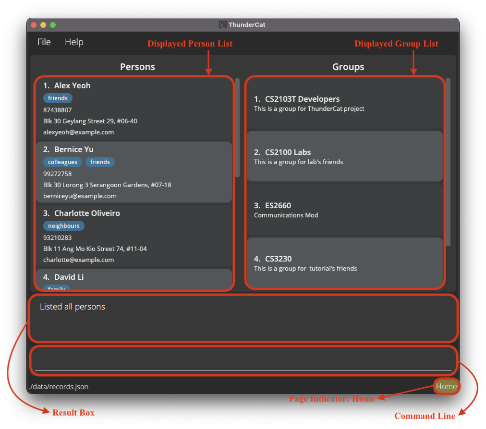
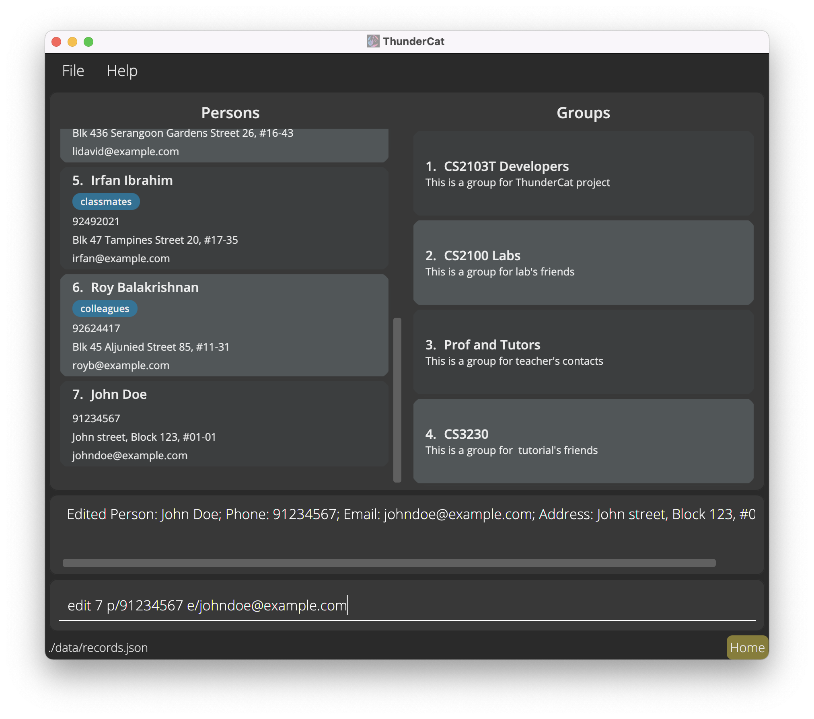
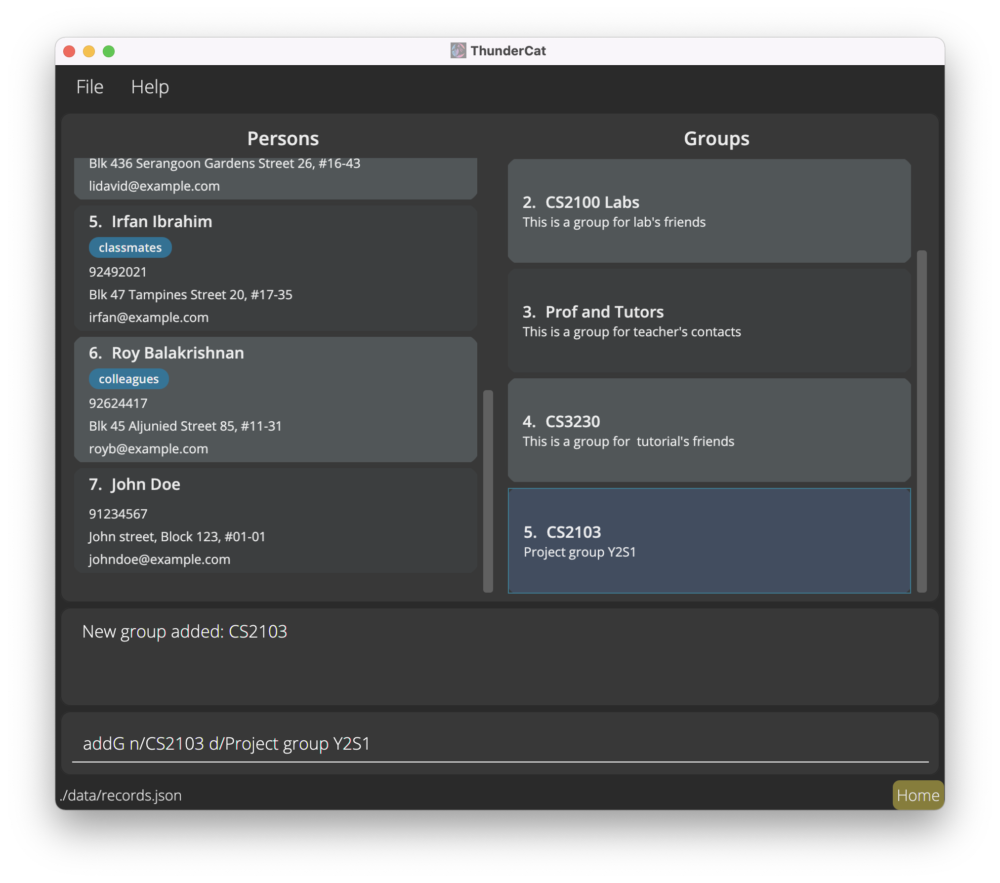
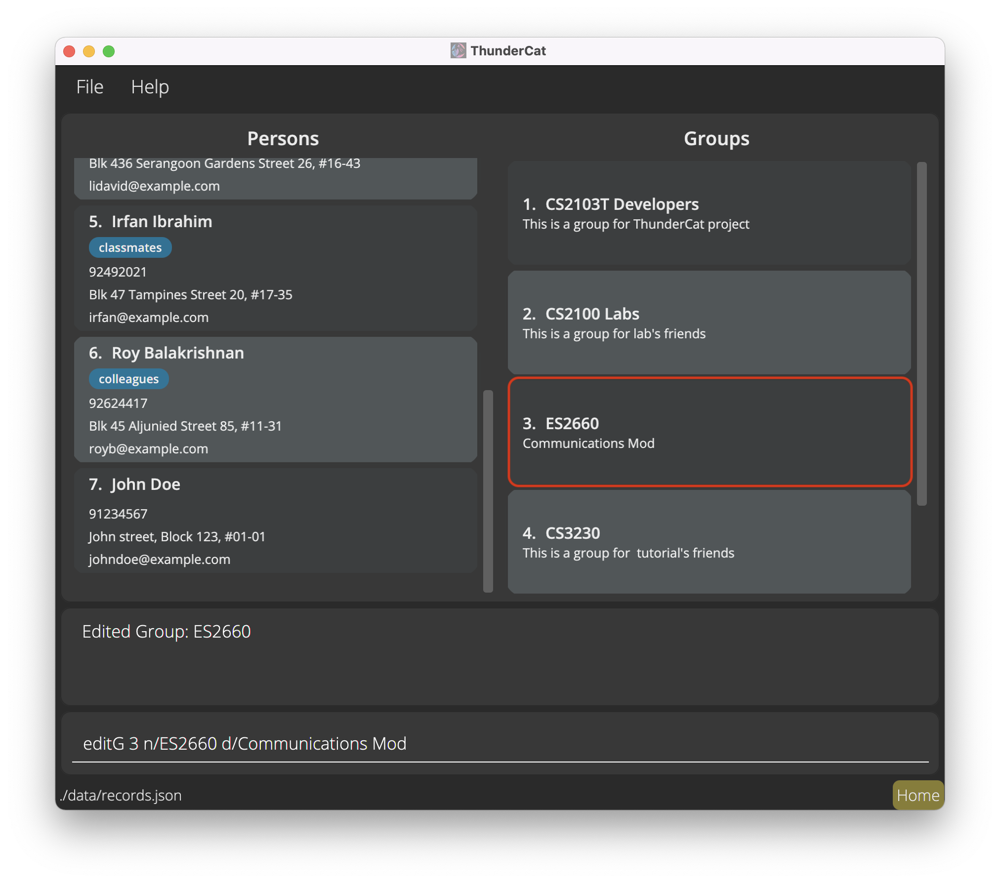
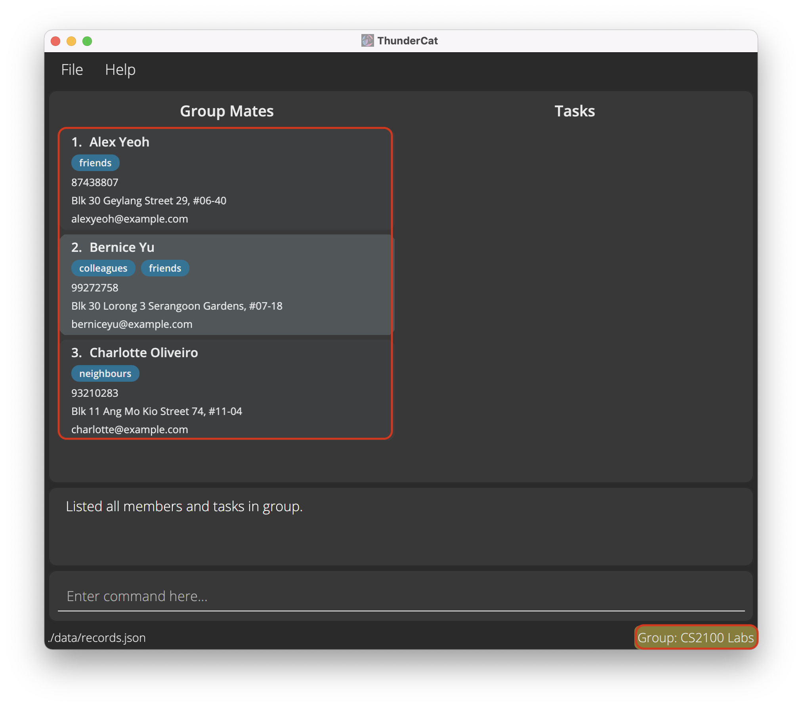
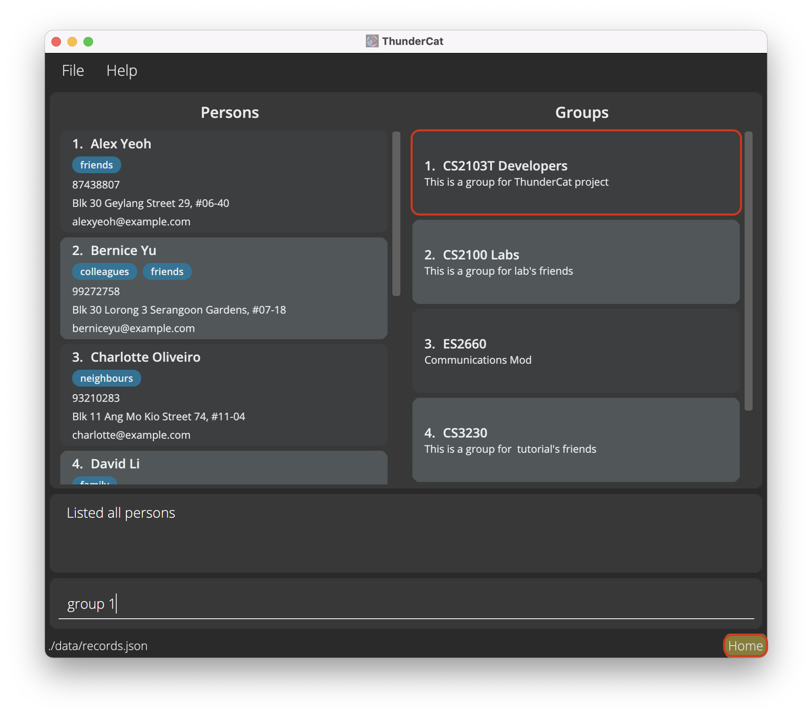
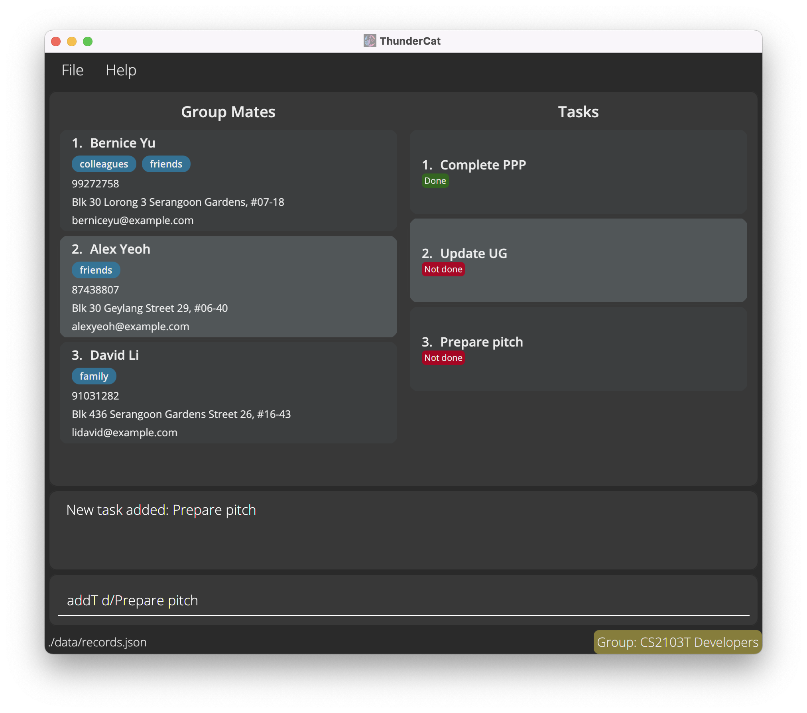
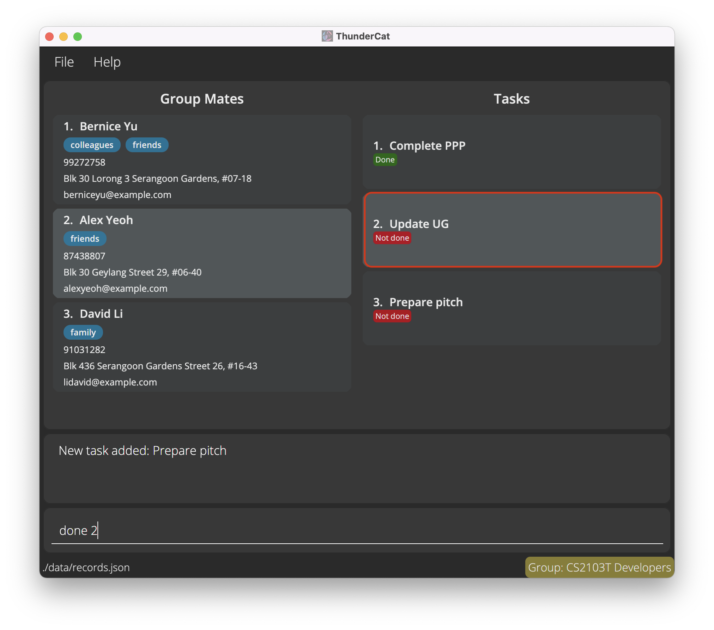
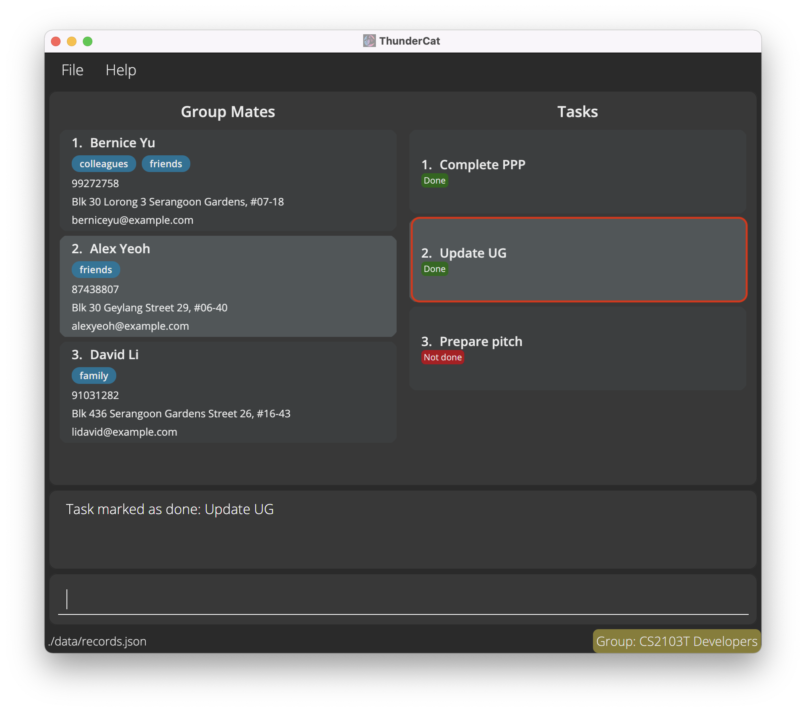

ThunderCat (TC) is a **desktop app designed for Year 2 Computing Students.** The application acts as an address book for contacts with *added support for group projects*. You can manage contacts, organise them into project groups and manage your tasks according to those groups. 

ThunderCat **also** acts as a tool for Year 2 Computing Students to build up their confidence in using a **Command Line Interface** ([CLI](#cli-glossary)) to navigate applications and manipulating **[JSON](#json) files** - a popular data file format widely used in Computing.

ThunderCat **does not** act as a messaging application. This application is optimized for you to use via a **Command Line Interface** ([CLI](#cli-glossary)) while still having the benefits of a Graphical User Interface ([GUI](#gui-glossary)). If you can type fast, ThunderCat can get your project groups' management tasks done faster than traditional GUI apps.

___
<a name="table-of-contents"></a>
* Table of Contents
{:toc}
  

--------------------------------------------------------------------------------------------------------------------

## About The Guide

Given that ThunderCat is designed for Year 2 Computing students, this user guide assumes that you have 
a basic level of technical knowledge of [CLI](#cli-glossary) and [JSON](#json), as well as terms like 'parameters', 'boolean' and 'array'. This guide also serves its purpose to 
help you improve on and get used to [CLI](#cli-glossary) and [JSON](#json) usages. This user guide also provides some elaboration 
on certain technical terms that you likely may not be familiar with especially since you are a student. 
The definitions for some of these terms can be found in the [glossary](#glossary).

### Navigation

Use the [table of contents](#table-of-contents) to navigate this user guide easily. There will also be links in some sections linking to other relevant sections within this user guide or to other websites which provide useful information.

### Formatting

There are blocks that have coloured backgrounds and have icons. The content of these highlight useful information:

<div markdown="span" class="alert alert-primary">:bulb: **Tip:**
This is a tip.
</div>

<div markdown="span" class="alert alert-success">:tv: **Page(s):**
Lists the screen(s) you can use the commands in.
</div>

<div markdown="span" class="alert alert-info">:information_source: **[HEADING]:**
This provides further information.
</div>

<div markdown="span" class="alert alert-warning">:exclamation: **Caution:**
This is a warning.
</div>

[To table of contents](#table-of-contents)

--------------------------------------------------------------------------------------------------------------------

## Quick start

1. Ensure you have Java `11` or above installed in your Computer.

1. Download the latest `ThunderCat.jar` from [here](https://github.com/AY2122S1-CS2103T-W17-3/tp/releases).

1. Copy the file to the folder you want to use as the _home folder_ for the application.

1. Double-click the file to start the app. The [GUI](#gui-glossary) as shown by the example below should appear in a few seconds. Note how the app contains some sample data.<br>
   

1. For Mac Users encountering this issue, follow this [guide](https://support.apple.com/en-sg/guide/mac-help/mh40616/mac) to launch the application.<br>
   

1. Type the command in the command box and enter to execute it. e.g. typing **`help`** and entering will open the help window.<br>
   Some example commands you can try:

   * **`list`** : Lists all persons.

   * **`add`**`n/John Doe p/98765432 e/johnd@example.com a/John street, block 123, #01-01` : Adds a person named `John Doe` to the application's records.

   * **`delete`**`3` : Deletes the 3rd person shown in the displayed list.

   * **`clear`** : Deletes all data in ThunderCat.

   * **`exit`** : Exits the app.

1. Refer to the [Features](#features) below for details of each command.

[To table of contents](#table-of-contents)


--------------------------------------------------------------------------------------------------------------------

## Graphical User Interface (GUI)

<a name="home-page-anchor"></a>
* **Home Page**: The home page where the lists of persons and groups are displayed.<br>
  <br>

<a name="group-info-page-anchor"></a>
* **Group Information Page**: The group information page where the lists of group members and tasks are displayed.<br>
 <br>](images/user-guide/GroupInformationPanel.png)

[To table of contents](#table-of-contents)

--------------------------------------------------------------------------------------------------------------------

## Features

<div markdown="block" class="alert alert-info">

**:information_source: Notes about the command format:**<br>

* Words in `UPPER_CASE` are the parameters to be supplied by the user.<br>
  e.g. in `add n/NAME`, `NAME` is a parameter which can be used as `add n/John Doe`.

* Items in square brackets are optional.<br>
  e.g `n/NAME [t/TAG]` can be used as `n/John Doe t/friend` or as `n/John Doe`.

* Items with `…`​ after them can be used multiple times including zero times.<br>
  e.g. `[t/TAG]…​` can be used as ` ` (i.e. 0 times), `t/friend`, `t/friend t/family` etc.

* Parameters can be in any order.<br>
  e.g. if the command specifies `n/NAME p/PHONE_NUMBER`, `p/PHONE_NUMBER n/NAME` is also acceptable.

* If a parameter is expected only once in the command but you specified it multiple times, only the last occurrence of the parameter will be taken.<br>
  e.g. if you specify `p/12341234 p/56785678`, only `p/56785678` will be taken.

* Extra parameters for commands that do not take in parameters (such as `help`, `list`, `exit` and `clear`) will be ignored.<br>
  e.g. if the command specifies `help 123`, it will be interpreted as `help`.

</div>

[To table of contents](#table-of-contents)

### Command Overview

Action | Format | Examples | [Home Page](#home-page-anchor) | [Group Information Page](#group-info-page-anchor)
--------|---------|---------|---------|---------
**Add person** | `add n/NAME p/PHONE_NUMBER e/EMAIL a/ADDRESS [t/TAG]…​` | `add n/James Ho p/22224444 e/jamesho@example.com a/123, Clementi Rd, 1234665 t/friend t/colleague` | :white_check_mark:
**Clear all** | `clear` | | :white_check_mark: | :white_check_mark:
**Delete person** | `delete INDEX` | `delete 3` | :white_check_mark:
**Edit person** | `edit INDEX [n/NAME] [p/PHONE_NUMBER] [e/EMAIL] [a/ADDRESS] [t/TAG]…​`|`edit 2 n/James Lee e/jameslee@example.com` | :white_check_mark: |
**Find person** | `find KEYWORD [MORE_KEYWORDS]` | `find James Jake` | :white_check_mark: |
**List all persons** | `list` | | :white_check_mark: | :white_check_mark:
**Create Group** | `addG n/GROUP_NAME [d/DESCRIPTION]` | `addG n/CS2103 d/Project Group` | :white_check_mark: | :white_check_mark:
**Show all Groups** | `groups` | | :white_check_mark: | :white_check_mark:
**Show Group information** | `group GROUP_INDEX` | `group 2` | :white_check_mark:
**Edit Group** | `editG GROUP_INDEX [n/NAME] [d/DESCRIPTION]` | `editG 2 n/CS2103T d/New project group for Y2S1` | :white_check_mark:
**Find Group** | `findG KEYWORD [MORE_KEYWORDS]` | | :white_check_mark:
**Delete Group** | `deleteG GROUP_INDEX` | `deleteG 2` | :white_check_mark:
**Join Group** | `joinG p/PERSON_INDEX_1 p/PERSON_INDEX_2 …​ g/GROUP_INDEX` | `joinG p/1 p/2 g/2` | :white_check_mark: |
**Remove person from Group** | `remove PERSON_INDEX` | `remove 2` | | :white_check_mark:
**Add task to group** | `addT d/DESCRIPTION` | `addT d/read book` | | :white_check_mark:
**Mark task as done** | `done TASK_INDEX` | `done 3`  | | :white_check_mark:
**Delete task in group** | `deleteT TASK_INDEX` | `deleteT 1`  | | :white_check_mark:
**Undo a command** | `undo`  | | :white_check_mark: | :white_check_mark:
**Exit application** | `exit` | | :white_check_mark: | :white_check_mark:
**Help** | `help`| | :white_check_mark: | :white_check_mark:

[To table of contents](#table-of-contents)

### Persons
#### Adding a person: `add`

Adds a person to ThunderCat.

<div markdown="block" class="alert alert-primary">

:tv: **Tip:**

[Page(s)](#graphical-user-interface) which you can use this command in
* [Home Page](#home-page-anchor)

</div>

<div markdown="span" class="alert alert-primary">:bulb: **Tip:**
A person can have any number of tags (including 0)
</div>

Format: `add n/NAME p/PHONE_NUMBER e/EMAIL [a/ADDRESS] [t/TAG]…​`


Examples:
* `add n/John Doe p/98765432 e/johnd@example.com a/John street, Block 123, #01-01`<br>
  <br>
  

[To table of contents](#table-of-contents)

#### Listing all persons : `list`

Shows a list of all persons in ThunderCat. Returns you to the [Home Page](#home-page-anchor).

<div markdown="block" class="alert alert-success">:tv: **Page(s):**

[Page(s)](#graphical-user-interface) which you can use this command in.
* [Home Page](#home-page-anchor)
* [Group Information Page](#group-info-page-anchor)
</div>

<div markdown="span" class="alert alert-primary">:bulb: **Tip:**
Does not reset your displayed group list after a `findG` command! Use the `groups` command for that.
</div>

Format: `list`

[To table of contents](#table-of-contents)

#### Editing a person : `edit`

Edits an existing person in ThunderCat.

<div markdown="block" class="alert alert-success">:tv: **Page(s):**

[Page(s)](#graphical-user-interface) which you can use this command in.
* [Home Page](#home-page-anchor)
* [Group Information Page](#group-info-page-anchor)
</div>

Format: `edit INDEX [n/NAME] [p/PHONE] [e/EMAIL] [a/ADDRESS] [t/TAG]…​`

* Edits the person at the specified `INDEX`. The index refers to the index number shown in the displayed person list. The index **must be a positive integer** 1, 2, 3, …​
* At least one of the optional fields must be provided.
* Existing values will be updated to the input values.
* When editing tags, the existing tags of the person will be removed i.e adding of tags is not cumulative.
* You can remove all the person’s tags by typing `t/` without specifying any tags after it.
* You can remove a person's address by typing `a/` without specifying any address after it.

Examples:
* `edit 2 n/Betsy Crower t/` Edits the name of the 2nd person to be `Betsy Crower` and clears all existing tags.
* `edit 7 p/91234567 e/johndoe@example.com` Edits the phone number and email address of the 7th person to be `91234567` and `johndoe@example.com` respectively.<br>
    <br>
    

[To table of contents](#table-of-contents)

#### Locating persons by name: `find`

Finds persons whose names contain any of the given keywords in ThunderCat.

<div markdown="block" class="alert alert-success">:tv: **Page(s):**

[Page(s)](#graphical-user-interface) which you can use this command in.
* [Home Page](#home-page-anchor)
</div>

Format: `find KEYWORD [MORE_KEYWORDS]`

* The search is case-insensitive. e.g `hans` will match `Hans`
* The order of the keywords does not matter. e.g. `Hans Bo` will match `Bo Hans`
* Only the name is searched.
* Only full words will be matched e.g. `Han` will not match `Hans`
* Persons matching at least one keyword will be returned (i.e. `OR` search).
  e.g. `Hans Bo` will return `Hans Gruber`, `Bo Yang`

Examples:
* `find John` returns `john` and `John Doe`
* `find alex david` returns `Alex Yeoh`, `David Li`<br>
  <br>
  

[To table of contents](#table-of-contents)

#### Deleting a person : `delete`

Deletes the specified person from ThunderCat (also removes the person from all groups that includes this person).

<div markdown="block" class="alert alert-success">:tv: **Page(s):**

[Page(s)](#graphical-user-interface) which you can use this command in.
* [Home Page](#home-page-anchor)
</div>

<div markdown="block" class="alert alert-primary">:bulb: **Tip:**
You can only indicate one INDEX to delete while using this command.
</div>

Format: `delete INDEX`

* Deletes the person at the specified `INDEX` and removes it from all related groups automatically.
* The index refers to the index number shown in the displayed person list.
* The index **must be a positive integer** 1, 2, 3, …​

Examples:
* `list` followed by `delete 2` deletes the 2nd person in ThunderCat.
* `find Betsy` followed by `delete 1` deletes the 1st person in the results of the `find` command.

[To table of contents](#table-of-contents)

### Groups
#### Creating a group : `addG`

Creates a group in ThunderCat with an optional description. A description for the group is optional.

<div markdown="block" class="alert alert-primary">

:tv: **Tip:**
[Page(s)](#graphical-user-interface) which you can use this command in.
* [Home Page](#home-page-anchor)
</div>

Format: `addG n/GROUP_NAME [d/DESCRIPTION]`

Examples:  
* `addG n/Family` adds a group with the name "Family" with the default description.
* `addG n/CS2103 d/Project group Y2S1` adds a group with the name "CS2103" with the description "Project group Y2S1".<br>
  <br>
  

[To table of contents](#table-of-contents)

#### Viewing all groups: `groups`

Shows a list of all groups in ThunderCat. Returns you to the [Home Page.](#home-page-anchor)

<div markdown="block" class="alert alert-success">:tv: **Page(s):**

[Page(s)](#graphical-user-interface) which you can use this command in.
* [Home Page](#home-page-anchor)
* [Group Information Page](#group-info-page-anchor)
</div>

<div markdown="span" class="alert alert-primary">:bulb: **Tip:**
Does not reset your displayed persons list after a `find` command! Use the `list` command for that.
</div>

Format: `groups`

[To table of contents](#table-of-contents)

#### Editing a group: `editG`

Edits an existing group in ThunderCat.

<div markdown="block" class="alert alert-success">:tv: **Page(s):**

[Page(s)](#graphical-user-interface) which you can use this command in.
* [Home Page](#home-page-anchor)
</div>

Format: `editG GROUP_INDEX [n/NAME] [d/DESCRIPTION]`

* The group with the specified `GROUP_INDEX` will be edited.
* The `GROUP_INDEX` refers to the index number shown in the last displayed group list.
* The index **must be a positive integer** 1, 2, 3, …​
* Description can be empty if group was created without one but once set, description should never be empty.

Example:
* `editG 3 n/ES2660 d/Communications Mod` edits the name, and the description of the 3rd group in the displayed group list to be "ES2660" and "Communication Mod" respectively.
  <span style="font-size:27px"><center><b>Before</b></center></span>
    
  <span style="font-size:27px"><center><b>After</b></center></span>
    

[To table of contents](#table-of-contents)

#### Locating groups by name: `findG`

Find groups whose names contain any of the given keywords in ThunderCat.

<div markdown="block" class="alert alert-success">:tv: **Page(s):**

[Page(s)](#graphical-user-interface) which you can use this command in.
* [Home Page](#home-page-anchor)
</div>

Format: `findG KEYWORD [MORE_KEYWORDS]`

* The search is case-insensitive. e.g `cs2103T` will match `CS2103T`
* The order of the keywords does not matter. e.g. `Favourite Group` will match `Group Favourite`
* Only the group name is searched.
* Only full words will be matched e.g. `CS2103` will not match `CS2103T`
* Groups matching at least one keyword will be returned (i.e. `OR` search).
  e.g. `CS2103T` will return `CS2103T Friends`, `CS2103T Tutors`

Examples:
* `findG CS2103T` returns `CS2103T Mates` and `CS2103T Tutors`
* `findG CS2103T Mates` returns `CS2103T Project Mates`, `Lectures CS2103T`

  

[To table of contents](#table-of-contents)

#### Deleting a group : `deleteG`

Deletes the specified group from ThunderCat.

<div markdown="block" class="alert alert-success">:tv: **Page(s):**

[Page(s)](#graphical-user-interface) which you can use this command in.
* [Home Page](#home-page-anchor)
</div>

<div markdown="block" class="alert alert-primary">:bulb: **Tip:**
You can only indicate one INDEX to delete while using this command.
</div>

Format: `deleteG GROUP_INDEX`

* Deletes the group at the specified `GROUP_INDEX`.
* The group index refers to the group number shown in the displayed group list.
* The index **must be a positive integer** 1, 2, 3, …​

Examples:
* `deleteG 2` deletes the 2nd group in ThunderCat.

[To table of contents](#table-of-contents)

#### Adding multiple people to a group : `joinG`

Adds multiple specified people to a specified group in ThunderCat.

<div markdown="block" class="alert alert-success">:tv: **Page(s):**

[Page(s)](#graphical-user-interface) which you can use this command in.
* [Home Page](#home-page-anchor)
</div>

Format: `joinG p/PERSON_INDEX_1 p/PERSON_INDEX_2 …​ g/GROUP_INDEX`

* Adds to a group specified at `GROUP_INDEX`, multiple people specified at `PERSON_INDEX_1 PERSON_INDEX_2 …​`.
* The group index refers to the group number shown in the displayed group list.
* The person index refers to the person index number show in the displayed person list.
* Group index **must be a positive integer** 1, 2, 3, …​
* Person index **must be a positive integer** 1, 2, 3, …​

Examples:
* `joinG p/1 p/2 p/3 g/2` adds persons indexed 1, 2, 3 in the displayed person list to group 2 in the displayed group list.
  <span style="font-size:27px"><center><b>Second group initially</b></center></span>
    
  <span style="font-size:27px"><center><b>Type JoinG command in [Home Page](#home-page-anchor)</b></center></span>
      
  <span style="font-size:27px"><center><b>Second group after</b></center></span>
      

[To table of contents](#table-of-contents)

#### Listing all group mates and tasks in a group: `group`

Lists out all the group mates and tasks in the specified group in ThunderCat.

<div markdown="block" class="alert alert-success">:tv: **Page(s):**

[Page(s)](#graphical-user-interface) which you can use this command in.
* [Home Page](#home-page-anchor)
</div>

Format: `group GROUP_INDEX`

* The group mates and tasks in the group at the specified `GROUP_INDEX` are listed out.
* The `GROUP_INDEX` refers to the index number shown in the displayed group list.
* The index **must be a positive integer** 1, 2, 3, …​

Example:
* `group 1` shows the information of the group at index 1 of the displayed group list.<br>
<br>
  <span style="font-size:27px"><center><b>Before</b></center></span>
    
  <span style="font-size:27px"><center><b>After</b></center></span>
    

[To table of contents](#table-of-contents)

#### Remove a person from the current group: `remove`

Removes the specified person from the group that ThunderCat is displaying.

<div markdown="block" class="alert alert-success">:tv: **Page(s):**

[Page(s)](#graphical-user-interface) which you can use this command in.
* [Group Information Page](#group-info-page-anchor)
</div>

<div markdown="span" class="alert alert-primary">:bulb: **Tip:**
Not to be confused with the `delete` command.
</div>

Format: `remove PERSON_INDEX`

* The groupmate with the specified `PERSON_INDEX` will be removed from the group.
* The `PERSON_INDEX` refers to the index number shown in the displayed person list.
* The index **must be a positive integer** 1, 2, 3, …​

Example:
* `remove 2` removes the 2nd person in the displayed person list from the group.

[To table of contents](#table-of-contents)

### Tasks
#### Adding a task to the current group: `addT`

Adds a task to the group that ThunderCat is displaying. By default, the task is marked `Not done`.

<div markdown="block" class="alert alert-success">:tv: **Page(s):**

[Page(s)](#graphical-user-interface) which you can use this command in.
* [Group Information Page](#group-info-page-anchor)
</div>

<div markdown="span" class="alert alert-warning">:exclamation: **Caution:**
The task's name can only be displayed up to first 70 characters.
</div>

Format: `addT d/TASK_DESCRIPTION`

Example:
* `addT d/Prepare pitch` adds a task with the description "Prepare pitch" to the group and is marked `Not done` by default.<br>
  <br>
  

[To table of contents](#table-of-contents)

#### Deleting a task from the current group: `deleteT`

Deletes the specified task from the group that ThunderCat is displaying.

<div markdown="block" class="alert alert-success">:tv: **Page(s):**

[Page(s)](#graphical-user-interface) which you can use this command in.
* [Group Information Page](#group-info-page-anchor)
</div>

<div markdown="block" class="alert alert-primary">:bulb: **Tip:**
You can only indicate one TASK_INDEX to delete while using this command.
</div>

Format: `deleteT TASK_INDEX`

* The task with the specified `TASK_INDEX` will be removed from the current group.
* The `TASK_INDEX` refers to the index number shown in the displayed task list.
* The index **must be a positive integer** 1, 2 ,3, …​

Example:
* `deleteT 1` deletes the 1st task in the displayed task list.

[To table of contents](#table-of-contents)

#### Marking a task as done: `done`

Marks the specified task in the group as done.

<div markdown="block" class="alert alert-success">:tv: **Page(s):**

[Page(s)](#graphical-user-interface) which you can use this command in.
* [Group Information Page](#group-info-page-anchor)

</div>

Format: `done TASK_INDEX`

* The task with the specified `TASK_INDEX` will be marked as done.
* The `TASK_INDEX` refers to the index number shown in the task list.
* The index **must be a positive integer** 1, 2, 3, …​

Example:
* `done 2` marks the 2nd task in the displayed task list as done.
  <span style="font-size:27px"><center><b>Before</b></center></span>
    
  <span style="font-size:27px"><center><b>After</b></center></span>
      

[To table of contents](#table-of-contents)

### General:

#### Undoing an undoable command : `undo`

Undoes an undoable command.

<div markdown="block" class="alert alert-success">:tv: **Page(s):**

[Page(s)](#graphical-user-interface) which you can use this command in.
* [Home Page](#home-page-anchor)
* [Group Information Page](#group-info-page-anchor)

</div>

Format: `undo`

* The following are the commands that can be undone:
  * [`add`](#adding-a-person-add)
  * [`addG`](#creating-a-group--addg)
  * [`addT`](#adding-a-task-to-the-current-group-addt)
  * [`clear`](#clearing-all-entries--clear)
  * [`delete`](#deleting-a-person--delete)
  * [`deleteG`](#deleting-a-group--deleteg)
  * [`deleteT`](#deleting-a-task-from-the-current-group-deletet)
  * [`edit`](#editing-a-person--edit)
  * [`editG`](#editing-a-group-editg)
  * [`joinG`](#adding-multiple-people-to-a-group--joing)
  * [`done`](#marking-a-task-as-done-done)
  * [`remove`](#remove-a-person-from-the-current-group-remove)

[To table of contents](#table-of-contents)

#### Clearing all entries : `clear`

Clears all entries from ThunderCat.

<div markdown="block" class="alert alert-primary">

:tv: **Tip:**
[Page(s)](#graphical-user-interface) which you can use this command in
* [Home Page](#home-page-anchor)
* [Group Information Page](#group-info-page-anchor)
</div>

<div markdown="span" class="alert alert-primary">:bulb: **Tip:**
If done accidentally, you can use the undo command to undo the clear!
</div>

Format: `clear`

[To table of contents](#table-of-contents)

#### Viewing help : `help`

Shows a message explaining how to access the command summary on this user guide.


<div markdown="block" class="alert alert-primary">

:tv: **Tip:**
[Page(s)](#graphical-user-interface) which you can use this command in
* [Home Page](#home-page-anchor)
* [Group Information Page](#group-info-page-anchor)
</div>

Format: `help`

[To table of contents](#table-of-contents)

#### Exiting the program : `exit`

Exits ThunderCat.

Format: `exit`

[To table of contents](#table-of-contents)

--------------------------------------------------------------------------------------------------------------------

## Data Storage
### Saving the data

The data is saved in the hard disk automatically after any command that changes the data. There is no need to save manually.

[To table of contents](#table-of-contents)

### Loading the data

The data is loaded automatically from the hard disk when the application starts. There is no need to load the data manually.

If there is no data file to load, such as when the application has just been downloaded and has not been run yet or when the data file is deleted, then sample records are loaded instead.

<div markdown="span" class="alert alert-primary">:bulb: **Tip:**
Use [`clear`](#clearing-all-entries--clear) to easily and quickly remove the sample records if desired.
</div>

If the data file has an invalid format, such as after editing the file wrongly, then the application will discard all the data and start with an empty data file on the next run. This is **irreversible**.

[To table of contents](#table-of-contents)

### Editing the data file
<div markdown="span" class="alert alert-warning">:exclamation: **Caution:**
This piece of information is meant for more advanced users.
</div>

The data is saved as a [JSON](#json) file called `records.json` located in `[JAR file location]/data`. Advanced users are welcome to update data directly by editing that data file.

<div markdown="span" class="alert alert-warning">:exclamation: **Caution:**
If any of the changes you make to the data file makes it have an invalid format, the application will discard all the data and start with an empty data file on the next run. This is **irreversible**.
</div>

[To table of contents](#table-of-contents)

#### Structure of the data file

The data file consists of a [JSON](#json) object containing a `persons` [JSON](#json) array and a `groups` [JSON](#json) array:

```json
{
  "persons" : [
    ...
  ],
  "groups" : [
    ...
  ]
}
```

The `persons` [JSON](#json) array consists of entries of each saved person and their details structured as a [JSON](#json) object. The order the entries appear in the [JSON](#json) array determines the order the entries will appear in ThunderCat.

In each person entry, these are the required attributes:
* `"name"` is a string that refers to the person's saved name.
* `"phone"` is a string that refers to the person's saved phone number.
* `"email"` is a string that refers to the person's saved email.
* `"address"` is a string that refers to the person's saved address.

There are also some optional attributes:
* `"tagged"` is a [JSON](#json) array that contains strings that each refer to a tag the person is assigned.
* `"id"` is a string which is used by group entries to refer to the person with the ID as a group mate.
  * Each ID is made of two _[hexadecimal](#hexadecimal)_ numbers separated by a hyphen `[hex]-[hex]`.
  * Each ID must be unique among all person entries.
  * The value of the ID does not matter, so it can have any value, so long as each ID is **unique** among all person entries.
  * If a person belongs to a group, then the person must have an ID and this ID must also appear in that group's `groupMateIds` [JSON](#json) array.

<div markdown="span" class="alert alert-primary">:bulb: **Tip:**

If you are not familiar with _[hexadecimal](#hexadecimal)_ numbers, it suffices to use the usual decimal numbers (so using only the digits from 0 to 9).
</div>

```json
{
  "persons" : [ {
    "name" : "Alex Yeoh",
    "phone" : "87438807",
    "email" : "alexyeoh@example.com",
    "address" : "Blk 30 Geylang Street 29, #06-40",
    "tagged" : [ "friends" ]
  }, {
    "name" : "Bernice Yu",
    "phone" : "99272758",
    "email" : "berniceyu@example.com",
    "address" : "Blk 30 Lorong 3 Serangoon Gardens, #07-18",
    "id" : "49ec-f5d46507b2c"
  },
    ...
  ],
  "groups" : [
    ...
  ]
}
```

The `groups` [JSON](#json) array consists of entries of each saved group and its details structured as a JSON object. The order the entries appear in the [JSON](#json) array determines the order the entries will appear in ThunderCat.

In each group entry, this is the required attribute:
* `"name"` is a string that refers to the group's saved name.

These are the optional attributes:
* `"description"` is a string that refers to the group's saved description.
* `"groupMateIds"` is a [JSON](#json) array containing the IDs of the person entries of the group mates in the group.
  * The ID of each group mate must correspond to the ID in the group mate's person entry.
  * The group mate IDs must be unique within a group entry.
* `"tasks"` is a [JSON](#json) array containing the entries of each saved task of a group and its details structured as a [JSON](#json) object.

```json
{
  "persons" : [
    ...
  ],
  "groups" : [ {
    "name" : "ThunderCat",
    "description" : "CS2103T tP Group",
    "groupMateIds" : [ "49ec-f5d46507b2c", "0-0", "0-1", ... ],
    "tasks" : [
      ...
    ]
  }, {
    "name" : "Carry"
  },
    ...
  ]
}
```

The `tasks` [JSON](#json) array consists of the corresponding group's entries of each saved task and its details structured as a [JSON](#json) object. The order the entries appear in the [JSON](#json) array determines the order the entries will appear in ThunderCat.

In each task entry, these are the required attributes:
* `"description"` is a string that refers to the task's saved description.
* `"isDone"` is a boolean value that is set to `true` if the task is done and `false` otherwise.

```json
{
  "persons" : [
    ...
  ],
  "groups" : [ {
    "name" : "ThunderCat",
    ...
    "tasks" : [ {
      "description" : "Write the Developer Guide acknowledgements section",
      "isDone" : true
    }, {
      "description" : "Polish the Developer Guide",
      "isDone" : false
    } ]
  },
    ...
  ]
}
```

[To table of contents](#table-of-contents)

--------------------------------------------------------------------------------------------------------------------

## FAQ

**Q**: How do I transfer my data to another Computer?<br>
**A**: Install the app in the other computer and overwrite the empty data file it creates with the file that contains the data from the home folder of the application in your original computer.

[To table of contents](#table-of-contents)

--------------------------------------------------------------------------------------------------------------------

## Glossary

* **[Home Page](#home-page-anchor)**: The home page where the lists of persons and groups are displayed.<br>

* **[Group Information Page](#group-info-page-anchor)**: The group information page where the lists of group members and tasks are displayed.<br>

<a name="json"></a>
* **JSON**: JSON is an open standard file format and data interchange format that uses human-readable text to store and transmit data objects consisting of attribute–value pairs and arrays (or other serializable values).

<a name="hexadecimal"></a>
* **Hexadecimal**: Hexadecimal describes a base-16 number system. That is, it describes a numbering system containing 16 sequential numbers as base units (including 0) before adding a new position for the next number.

<a name="cli-glossary"></a>
* **CLI**: CLI stands for command line interface. Through the CLI, users interact with a system or application by typing in text (commands). The command is typed on a specific line following a visual prompt from the computer.

<a name="gui-glossary"></a>
* **GUI**: GUI stands for graphical user interface. The graphical user interface is a form of user interface that allows users to interact with electronic devices through graphical icons and audio indicator such as primary notation, instead of text-based user interfaces, typed command labels or text navigation.

[To table of contents](#table-of-contents)
